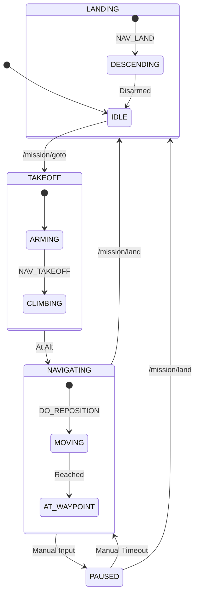

# Aircraft State Machine Design

This document describes the state logic for the ASAR mission controller, focusing on the transition between autonomous waypoint navigation and manual operator control.

## Overview

The mission controller manages the high-level flight phases by communicating with the PX4 Flight Controller via the uXRCE-DDS bridge. It translates ROS 2 mission commands into specific PX4 navigation states and commands.

### Key Principles
- **Safety First**: Manual input always overrides autonomous missions.
- **Smoothing**: Use PX4 internal trajectory generators (`AUTO_LOITER` + `REPOSITION`) instead of raw setpoints for smoother movement.
- **Robustness**: Reclaim control gracefully when manual override is released.

---

## PX4 Navigation States

The controller maps mission logic to the following native PX4 navigation states (`vehicle_status.nav_state`):

| State Name | ID | Description |
| :--- | :--- | :--- |
| `NAVIGATION_STATE_POSCTL` | 2 | **Manual/Position Control**. Aircraft maintains position but responds to manual stick inputs. Used for user teleop. |
| `NAVIGATION_STATE_AUTO_LOITER` | 4 | **Auto Loiter**. Aircraft holds position. We use this state to receive `VEHICLE_CMD_DO_REPOSITION` commands for autonomous flight. |
| `NAVIGATION_STATE_AUTO_TAKEOFF` | 10 | **Auto Takeoff**. Automated climb to a predefined altitude. |
| `NAVIGATION_STATE_AUTO_LAND` | 11 | **Auto Land**. Automated descent and disarming upon touchdown. |
| `NAVIGATION_STATE_OFFBOARD` | 7 | *Deprecated in this design*. Requires high-frequency setpoint streaming. Replaced by `AUTO_LOITER` for improved stability. |

---

## Operational Flows

### 1. Waypoint-Based Navigation (Autonomous)

This flow is triggered by a `/mission/goto` request. The controller's behavior depends on whether the aircraft is currently on the ground or in the air.

#### Scenario A: Start from Ground (Landed)
1.  **Standby**: Aircraft is disarmed.
2.  **Takeoff**:
    - Mission node sends `VEHICLE_CMD_NAV_TAKEOFF` (param7 = altitude).
    - PX4 handles arming and climbing in **`NAVIGATION_STATE_AUTO_TAKEOFF`**.
3.  **Transition**: Once takeoff is complete, the node switches to **`NAVIGATION_STATE_AUTO_LOITER`**.

#### Scenario B: Start from In-Air (Flying)
1.  **Handover**: If the aircraft is already flying (e.g., in `POSCTL` or manual), the node immediately requests **`NAVIGATION_STATE_AUTO_LOITER`**.
2.  **Sync**: The node caches the current mission target and proceeds to the Navigation step.

#### Navigation & Termination
4.  **Navigation**:
    - In **`NAVIGATION_STATE_AUTO_LOITER`**, the node sends `VEHICLE_CMD_DO_REPOSITION` with the target coordinates.
    - PX4 handles the trajectory planning.
5.  **Termination**:
    - Triggered by `/mission/land`.
    - Mission node sends `VEHICLE_CMD_NAV_LAND`.
    - PX4 transitions to **`NAVIGATION_STATE_AUTO_LAND`**.

### 2. Manual Override & Mission Pause

The system monitors `/teleop/manual_input` (relayed from the operator interface).

1.  **Detection**:
    - As soon as manual setpoints are detected, the mission node immediately triggers a mode switch to **`NAVIGATION_STATE_POSCTL`**.
    - The autonomous mission is considered **PAUSED**. The current mission target is cached.
2.  **Manual Control**:
    - The operator has full control over movement.
    - The mission node stops sending `REPOSITION` commands.
3.  **Resumption**:
    - When the manual input stream stops (timeout reached), the mission node "reclaims" control.
    - It switches the aircraft back to **`NAVIGATION_STATE_AUTO_LOITER`**.
    - It resends the cached `VEHICLE_CMD_DO_REPOSITION` command to resume the mission from the current location.

---

## Evaluation: Offboard vs. Auto Loiter

In previous iterations, `OFFBOARD` mode was used to drive the aircraft via `TrajectorySetpoint` messages at 20Hz. However, this approach presented several issues:
- **Jitter**: Any latency in the ROS-DDS bridge caused micro-stuttering in flight.
- **Complexity**: The mission node had to implement its own ramp-up/down logic for smooth motion.
- **Safety**: Losing the ROS connection in Offboard mode triggers a PX4 failsafe, which adds complexity to the recovery logic.

**Recommendation**: **Remove Offboard Mode usage.**
By using **`NAVIGATION_STATE_AUTO_LOITER`** combined with `VEHICLE_CMD_DO_REPOSITION`:
- We leverage PX4's high-performance internal position controller.
- The aircraft obeys all autopilot safety parameters (max tilt, speed, jerk).
- The "heartbeat" requirement is eliminated, as the command is persistent until reached or overridden.

---

## State Transition Diagram (Conceptual)

