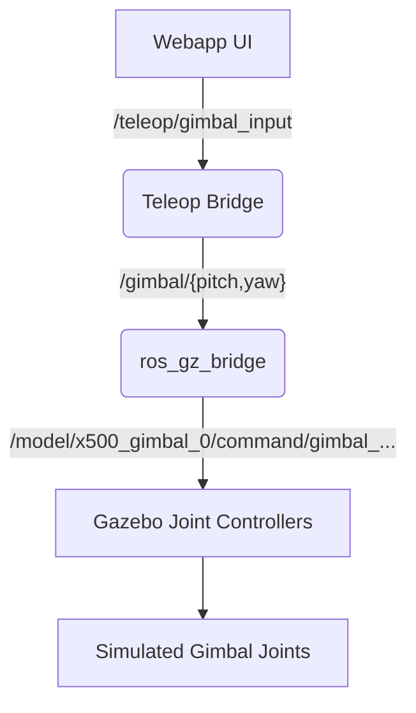

# Gimbal Control System

This document describes the architecture and implementation of the gimbal control system for the ASAR drone in simulation.

## Architecture Overview

The gimbal control follows a direct manipulation path that bypasses the PX4 flight controller's internal gimbal manager to ensure maximum reliability and responsiveness in the Gazebo SITL environment.



## Communication Pipeline

### 1. Frontend Input
The webapp Manual Control panel publishes rate-based commands derived from the "Gimbal Pan / Tilt" joystick.
- **Topic**: `/teleop/gimbal_input`
- **Message Type**: `px4_msgs/msg/GimbalManagerSetManualControl`
- **Key Fields**: `pitch_rate`, `yaw_rate` (range: -1.0 to 1.0)

### 2. Teleop Bridge (`teleop_node.py`)
The `teleop_node.py` acts as a rate-to-absolute integrator.
- **Logic**: It integrates the joystick rates over time to maintain an absolute pitch/yaw state.
- **Output Topics**: `/gimbal/pitch`, `/gimbal/yaw`
- **Message Type**: `std_msgs/msg/Float64`
- **Units**: Radians (converted from degrees after integration)

### 3. Gazebo Bridge (`launch_sim.sh`)
The `ros_gz_bridge` process established in `launch_sim.sh` maps the ROS topics to the low-level Gazebo joint topics.
- **Pitch Bridge**: `/gimbal/pitch` (ROS) → `/model/x500_gimbal_0/command/gimbal_pitch` (GZ)
- **Yaw Bridge**: `/gimbal/yaw` (ROS) → `/model/x500_gimbal_0/command/gimbal_yaw` (GZ)
- **Protocol**: `std_msgs/msg/Float64` (ROS) ↔ `gz.msgs.Double` (Gazebo)
- **Direction**: ROS to Gazebo (`]`)

## Design Rationale

### Why Direct Manipulation?
Initially, an attempt was made to use the **PX4 Gimbal Manager** via `VehicleCommand` (ID 1000/1001). However, in the current PX4 SITL setup for the `x500_gimbal` airframe, the internal uORB-to-Gazebo bridge does not reliably translate these high-level commands to the simulated joint controllers.

By using direct Gazebo joint manipulation:
- We achieve **zero-latency** response.
- We bypass complex PX4 parameter configurations (`MNT_MODE_OUT`, etc.).
- The system is **transparent** and easier to debug using standard Gazebo and ROS CLI tools.

## Troubleshooting

### Verifying Data Flow
To verify that commands are reaching the simulator, you can echo the bridged topics:

```bash
# Check ROS output from Teleop Bridge
ros2 topic echo /gimbal/pitch

# Check Gazebo input topics
gz topic -l | grep gimbal
```

### Checking the Bridge
If the gimbal is not moving, ensure the `ros_gz_bridge` is running and the direction is correctly set to `]` (ROS -> GZ) in the `launch_sim.sh` script.
